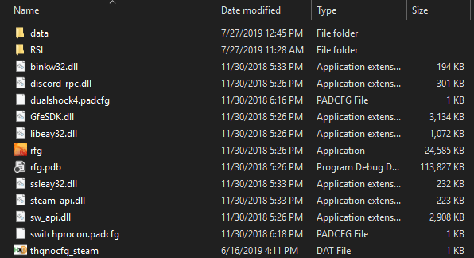

Installation
========================================================

Requirements
--------------------------------------------------------

- The `Visual Studio 2017 x86 Redistributable <https://aka.ms/vs/15/release/VC_redist.x86.exe>`_ is required for RSL. You might need to fully restart your PC for the install to properly complete.

Installation
--------------------------------------------------------

- Download the latest release from the `releases page <https://github.com/Moneyl/RFGR-Script-Loader-Wiki/releases>`_
- Unzip the release and copy the folder it contains into your Red Faction Guerrilla Re-mars-tered folder. In steam you can find that by right clicking the game in your library, clicking properties > Local files > Browse local files. After copying the files your RFGR folder should look something like this: 

   How your RFGR folder should look after a proper install. You might see a few other folders, which is fine.
- Run the RSL as admin. You can run it when the game is running or when it isn't. If the game isn't already running it should be started automatically.
- Wait until you hear 3 beeps. This means that the RSL has succesfully activated. It might take 5-10 seconds before occuring, and you'll likely need to load a save first before it's fully active.
- The RSL is now ready for use. You can use F1 to toggle the overlay where you'll see a welcome menu with more shortcuts. You should read the usage guide and scripting guides for more info.

Troubleshooting
----------------------------------------------------------

- Ensure that the RSL is running as admin. This will remain a requirement until injection is switched over to use a proxy DLL. The current injection method is not able to work if it's not run as admin unfortunately.
- Make sure to restart your computer if you haven't already after installing the Visual Studio 2017 x86 Redistributable. There have been a few instances where the installation wasn't properly completed until the user fully restarted. For best results you should fully power down and start your PC again after several seconds.
- If that doesn't solve your issue, please `create a new github issue <https://github.com/Moneyl/RFGR-Script-Loader-Wiki/issues/new>`_ or contact moneyl on the `Official Red Faction Discord server <https://discord.gg/redfaction>`_ in the mod_makers_talk channel.